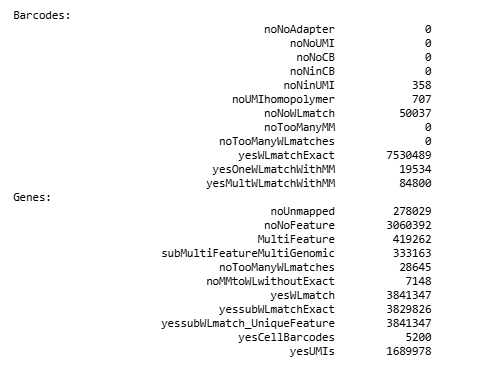
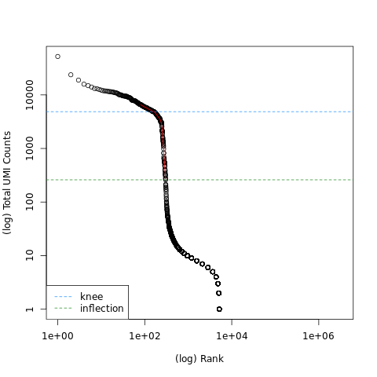
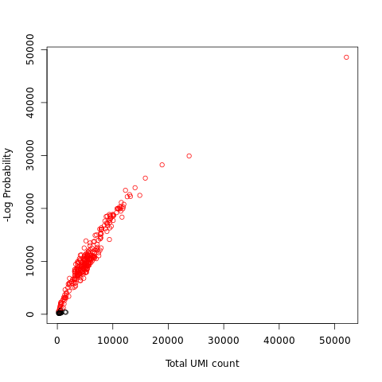

# Single_Cell_RNA_Seq
This repository organizes learning materials and practical references for single-cell RNA-seq into three core sections: 10x data pre-processing, basic scRNA-seq analysis, and AnnData fundamentals.

# Pre-processing of 10x Single-Cell RNA Datasets

## Introduction: Understand the 10x Genomics Workflow

This repository presents a concise step-by-step guide for pre-processing **10x Genomics single-cell RNA-seq data**, following the Galaxy Training Network tutorial:

- [Pre-processing of 10x Single-Cell RNA Datasets](https://training.galaxyproject.org/training-material/topics/single-cell/tutorials/scrna-preprocessing-tenx/tutorial.html)

In the 10x Genomics workflow, sequencing reads are labeled using **cell barcodes** and **unique molecular identifiers (UMIs)**, allowing transcript counts to be assigned to individual cells. The purpose of pre-processing is to convert raw sequencing data into a structured **count matrix**, inspect mapping and quantification results, and derive a filtered matrix containing high-quality cells for downstream single-cell analysis.

---

## Step 1: Producing a Count Matrix from FASTQ

This stage converts sequencing reads into an initial expression matrix suitable for inspection and filtering.

### a. Data upload and organization

Create a new Galaxy history and rename it, for example:

- `scRNA-seq 10X dataset tutorial`

Then import the required input files from Zenodo or the Galaxy data library.

### Input files

| **File type** | **File** | **Link** |
|---|---|---|
| FASTQ | `subset_pbmc_1k_v3_S1_L001_R1_001.fastq.gz` | [Download](https://zenodo.org/record/3457880/files/subset_pbmc_1k_v3_S1_L001_R1_001.fastq.gz) |
| FASTQ | `subset_pbmc_1k_v3_S1_L001_R2_001.fastq.gz` | [Download](https://zenodo.org/record/3457880/files/subset_pbmc_1k_v3_S1_L001_R2_001.fastq.gz) |
| FASTQ | `subset_pbmc_1k_v3_S1_L002_R1_001.fastq.gz` | [Download](https://zenodo.org/record/3457880/files/subset_pbmc_1k_v3_S1_L002_R1_001.fastq.gz) |
| FASTQ | `subset_pbmc_1k_v3_S1_L002_R2_001.fastq.gz` | [Download](https://zenodo.org/record/3457880/files/subset_pbmc_1k_v3_S1_L002_R2_001.fastq.gz) |
| Gene annotation | `Homo_sapiens.GRCh37.75.gtf` | [Download](https://zenodo.org/record/3457880/files/Homo_sapiens.GRCh37.75.gtf) |
| Barcode whitelist | `3M-february-2018.txt.gz` | [Download](https://zenodo.org/record/3457880/files/3M-february-2018.txt.gz) |

### Notes
- Create and rename a new history before uploading files.
- Import data directly via Zenodo links or from the Galaxy data library.
- At the end of this step, the history should contain **4 FASTQ files**, **1 GTF file**, and **1 barcode whitelist file**.

Proper file organization is necessary to ensure that downstream quantification tools interpret read structure and sample identity correctly.

---

## Step 2: Performing the Demultiplexing and Quantification

This stage assigns reads to cellular barcodes and transcripts, then generates output files summarizing alignment and quantification results.

### a. RNA STARsolo

Run **RNA STARsolo** in Galaxy using the following configuration to perform barcode-aware alignment and quantification.

### Tool
- **RNA STARsolo** (`Galaxy version 2.7.11a+galaxy1`)

### Parameters

| **Setting** | **Value** |
|---|---|
| Custom or built-in reference genome | Use a built-in index |
| Reference genome with or without an annotation | Use genome reference without builtin gene-model |
| Select reference genome | Human (*Homo sapiens*): hg19 Full or Human (*Homo sapiens*) (b37): hg19 |
| Gene model (gff3, gtf) file for splice junctions | `Homo_sapiens.GRCh37.75.gtf` |
| Length of genomic sequence around annotated junctions | `100` |
| Type of single-cell RNA-seq | Drop-seq or 10X Chromium |
| Input Type | Separate barcode and cDNA reads |
| RNA-Seq FASTQ/FASTA file, Barcode reads | `L001_R1_001`, `L002_R1_001` |
| RNA-Seq FASTQ/FASTA file, cDNA reads | `L001_R2_001`, `L002_R2_001` |
| RNA-Seq Cell Barcode Whitelist | `3M-february-2018.txt.gz` |
| Configure Chemistry Options | Chromium chemistry v3 |
| UMI deduplication (collapsing) algorithm | CellRanger2-4 algorithm |
| Type of UMI filtering | Remove UMIs with N and homopolymers |
| Matching the Cell Barcodes to the WhiteList | Multiple matches (CellRanger 2, 1MM_multi) |
| Strandedness of Library | Read strand same as the original RNA molecule |
| Collect UMI counts for these genomic features | Gene: Count reads matching the Gene Transcript |
| Cell filter type and parameters | Do not filter |
| Field 3 in the Genes output | Gene Expression |

### Input selection
Use multi-select for the FASTQ files:

- **Barcode reads:** `L001_R1_001`, `L002_R1_001`
- **cDNA reads:** `L001_R2_001`, `L002_R2_001`

### Purpose
This step performs:

- alignment to the human reference genome,
- barcode and UMI processing,
- transcript quantification,
- generation of an initial unfiltered count matrix for downstream quality assessment.

### b. Inspecting the Output Files

RNA STARsolo produces six main outputs:

| **Output** | **Description** |
|---|---|
| Log | Program log and mapping statistics |
| Feature Statistic Summaries | Barcode and quantification metrics |
| Alignments | BAM file of mapped reads |
| Matrix Gene Counts | Count matrix in Matrix Market format |
| Barcodes | Cell barcode list |
| Genes | Gene list |

The **log** and **feature summaries** files are the main sources for quality assessment. The matrix, barcode, and gene files together form the unfiltered count matrix.

#### i. Mapping Quality

Use **MultiQC** to inspect the STAR log.

**Tool:** `MultiQC (Galaxy version 1.27+galaxy0)`

| **Setting** | **Value** |
|---|---|
| Which tool was used generate logs? | STAR |
| Type of STAR output? | Log |
| STAR log output | `RNA STARsolo: log` |

**Result:**  
- **Uniquely mapped reads:** `87.5%`

This indicates good alignment quality.

#### ii. Quantification Quality

Inspect the **Feature Statistic Summaries** file directly in Galaxy.

Key metric groups:

| **Metric** | **Meaning** |
|---|---|
| Barcode mismatch metrics | Reads with barcodes not matching the whitelist |
| `noUnmapped + MultiFeature` | Reads without clear feature assignment |
| `yessubWLmatch_UniqueFeature` | Reads successfully counted |


> *Figure 1: RNA STARsolo feature statistic summary showing barcode matching and gene assignment metrics, including uniquely assigned reads, reads without annotated features, and the number of detected cell barcodes.*

**Key observations**
- **Detected cells (`yesCellBarcodes`)**: ~`5200`
- **Largest category**: `yessubWLmatch_UniqueFeature`
- **`noNoFeature`** reads may be relatively high and are generally expected for this dataset

At this stage, confirm that most reads map well, most usable reads are assigned to features, and the detected barcode count is reasonable.

---

## Step 3: Producing a Quality Count Matrix

The RNA STARsolo output matrix is provided in bundled 10x format (`matrix.mtx`, `genes.tsv`, `barcodes.tsv`). While this format is compatible with downstream single-cell workflows, it includes many low-quality or background barcodes. To generate a more representative count matrix, filter barcodes with **DropletUtils**.

### a. Cell Ranger-like filtering

Use **DropletUtils** to emulate the default Cell Ranger-style barcode filtering approach.

**Tool**
- **DropletUtils** (`Galaxy version 1.10.0+galaxy2`)

| **Setting** | **Value** |
|---|---|
| Format for the input matrix | Bundled (`barcodes.tsv`, `genes.tsv`, `matrix.mtx`) |
| Count Data | `Matrix Gene Counts` |
| Genes List | `Genes` |
| Barcodes List | `Barcodes` |
| Operation | Filter for Barcodes |
| Method | DefaultDrops |
| Expected Number of Cells | `3000` |
| Upper Quantile | `0.99` |
| Lower Proportion | `0.1` |
| Format for output matrices | Bundled (`barcodes.tsv`, `genes.tsv`, `matrix.mtx`) |

### b. Introspective method

For a more data-driven approach, first inspect barcode distributions and then apply custom filtering.

#### i. Rank barcodes

Generate a barcode rank plot to visualize total UMI counts across barcodes and help identify the transition between real cells and background droplets.

**Tool**
- **DropletUtils** (`Galaxy version 1.10.0+galaxy2`)

| **Setting** | **Value** |
|---|---|
| Format for the input matrix | Bundled (`barcodes.tsv`, `genes.tsv`, `matrix.mtx`) |
| Count Data | `Matrix Gene Counts` |
| Genes List | `Genes` |
| Barcodes List | `Barcodes` |
| Operation | Rank Barcodes |
| Lower Bound | `100` |


> *Figure 2: Barcode rank plot showing total UMI counts across ranked barcodes. The knee and inflection points indicate the approximate thresholds separating high-RNA cell-containing droplets from low-count empty droplets, providing a rough estimate of the expected number of cells in the sample.*

#### ii. Custom filtering

Apply **EmptyDrops** for barcode filtering based on statistical significance.

**Tool**
- **DropletUtils** (`Galaxy version 1.10.0+galaxy2`)

| **Setting** | **Value** |
|---|---|
| Format for the input matrix | Bundled (`barcodes.tsv`, `genes.tsv`, `matrix.mtx`) |
| Count Data | `Matrix Gene Counts` |
| Genes List | `Genes` |
| Barcodes List | `Barcodes` |
| Operation | Filter for Barcodes |
| Method | EmptyDrops |
| Lower-bound Threshold | `200` |
| FDR Threshold | `0.01` |
| Format for output matrices | Bundled (`barcodes.tsv`, `genes.tsv`, `matrix.mtx`) |


> *Figure 3: EmptyDrops detected-cells plot showing total UMI count versus negative log probability for each barcode. Barcodes with stronger evidence of deviating from the ambient RNA background are identified as likely real cells.*

### Notes
- The bundled matrix is highly sparse because it includes many low-count barcodes.
- **DefaultDrops** is a simple Cell Ranger-like option.
- **Rank Barcodes + EmptyDrops** provides a more flexible and interpretable filtering strategy.
- The filtered output can be used as a higher-quality input for downstream single-cell analysis.

---

## Summary of Workflow

The complete preprocessing procedure can be understood in three major steps:

1. **Produce an initial count matrix from FASTQ files**
2. **Inspect demultiplexing and quantification outputs**
3. **Generate a quality-controlled count matrix**

These steps establish the foundation for downstream single-cell RNA-seq analyses such as normalization, clustering, and cell-type annotation.

---

## Reference

This repository is based on the following tutorial:

- [Galaxy Training Network: Pre-processing of 10x Single-Cell RNA Datasets](https://training.galaxyproject.org/training-material/topics/single-cell/tutorials/scrna-preprocessing-tenx/tutorial.html)

# Basic scRNA-seq analysis

A step-by-step single-cell RNA sequencing (scRNA-seq) analysis pipeline using **Scanpy**, covering quality control, normalization, dimensionality reduction, clustering, and cell-type annotation.

---

##  Notebook

`basic-scrna-tutorial_updated.ipynb`

---
 
## Overview
This tutorial walks through a complete scRNA-seq analysis workflow on **bone marrow mononuclear cells** from healthy human donors (OpenProblems NeurIPS 2021 benchmarking dataset), measured with the **10X Multiome Gene Expression and Chromatin Accessibility kit**.
 
**Dataset:** 8,785 cells × 36,601 genes across 2 samples (`s1d1`, `s1d3`)
 
---
 
##  Installation
 
```bash
pip install anndata scanpy pooch scrublet leidenalg celltypist decoupler omnipath
pip install --upgrade scanpy igraph leidenalg
```
 
---
 
##  Dependencies
 
| Package | Purpose |
|---|---|
| `scanpy` | Core scRNA-seq analysis |
| `anndata` | Data structure (AnnData) |
| `pooch` | Data download/caching |
| `scrublet` | Doublet detection |
| `leidenalg` / `igraph` | Graph-based clustering |
| `celltypist` | Automatic cell-type annotation |
| `decoupler` | Enrichment-based annotation |
| `omnipath` | PanglaoDB marker database |
 
---
 
##  Workflow
 

```
 
---
 
##  References
 
- Luecken et al. (2021) — NeurIPS 2021 benchmarking dataset
- McCarthy et al. (2017) — scater QC metrics
- Wolock et al. (2019) — Scrublet doublet detection
- Traag et al. (2019) — Leiden clustering algorithm
- Domínguez Conde et al. (2022) — CellTypist immune atlas
- [Single Cell Best Practices Book](https://www.sc-best-practices.org/)
---
 
##  Resources
 
- [Scanpy Documentation](https://scanpy.readthedocs.io/)
- [AnnData Documentation](https://anndata.readthedocs.io/)
- [CellTypist](https://github.com/Teichlab/celltypist)
- [decoupler-py](https://github.com/saezlab/decoupler-py)
- [PanglaoDB](https://panglaodb.se/)
- [Single Cell Best Practices](https://www.sc-best-practices.org/)


